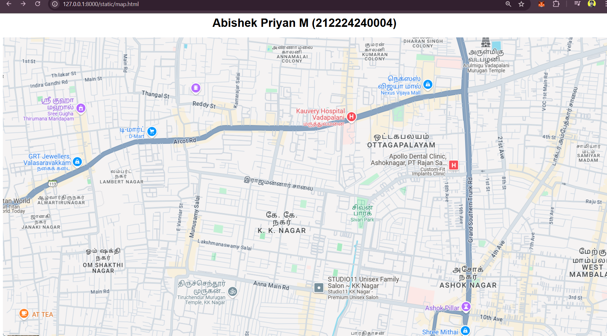
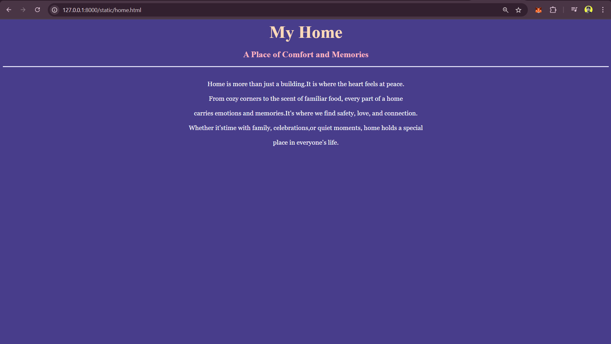
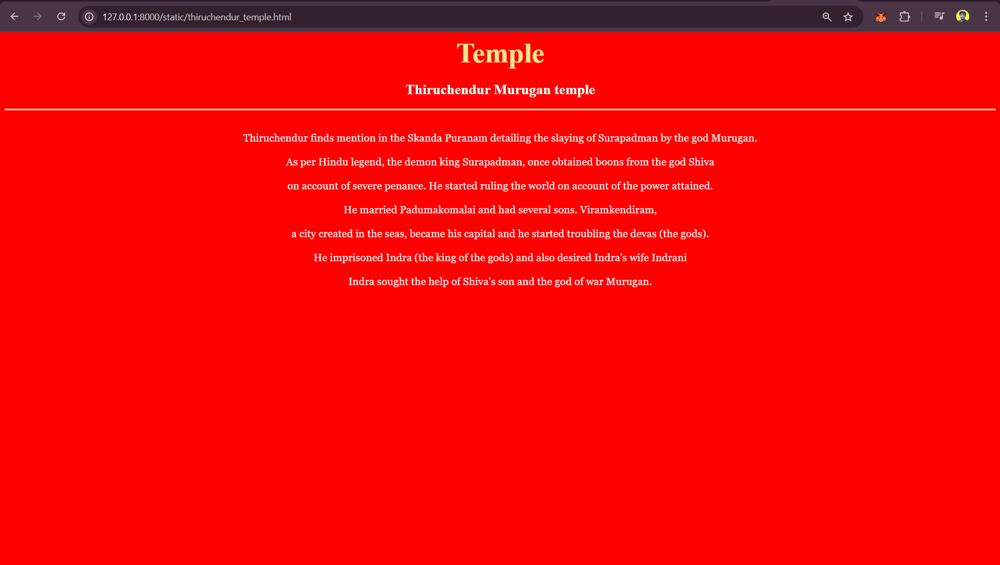
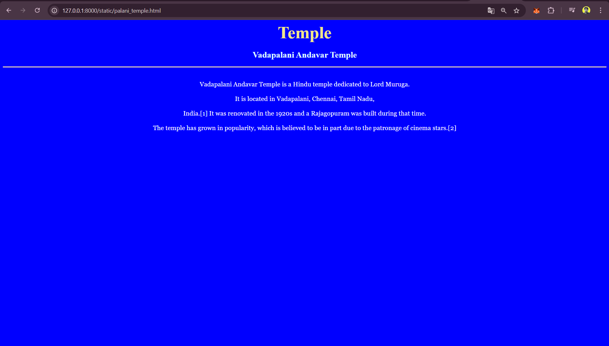
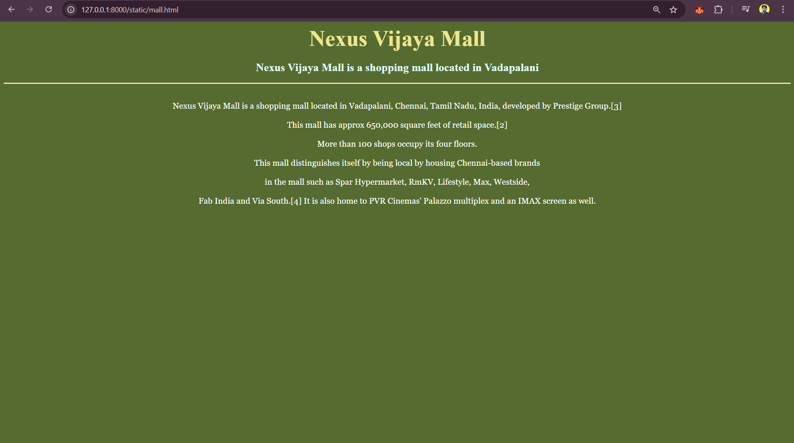
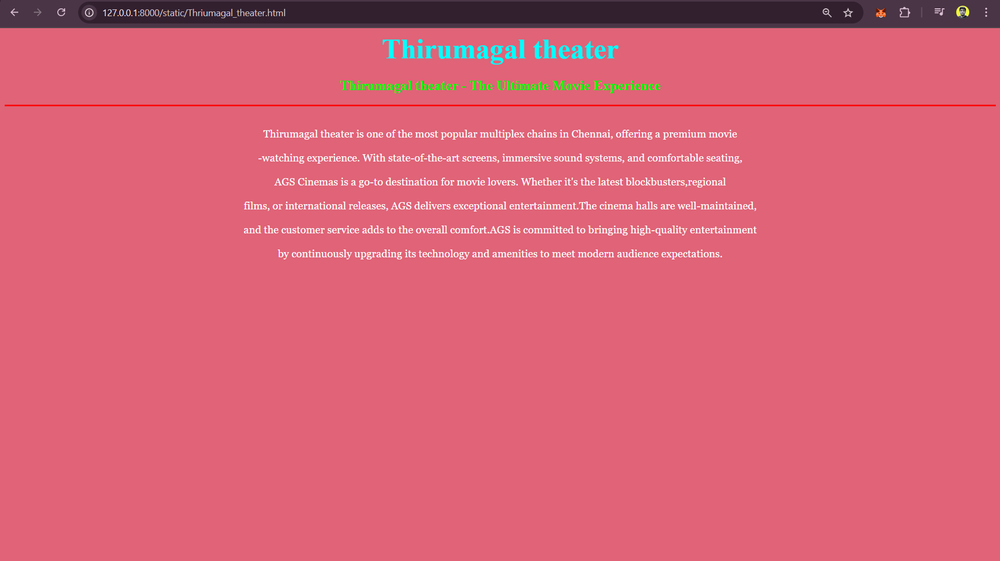

# Ex04 Places Around Me
## Date: 21/4/2025

## AIM
To develop a website to display details about the places around my house.

## DESIGN STEPS

### STEP 1
Create a Django admin interface.

### STEP 2
Download your city map from Google.

### STEP 3
Using ```<map>``` tag name the map.

### STEP 4
Create clickable regions in the image using ```<area>``` tag.

### STEP 5
Write HTML programs for all the regions identified.

### STEP 6
Execute the programs and publish them.

## CODE
~~~html
<html>
    <head>
        <title>
            Map
        </title>
    </head>
    <body>
        <center>
            <h1 style="font-family: Arial, Helvetica, sans-serif;">Abishek Priyan M (212224240004)</h1>
        
        <map name="MyCity">
            <area target="" alt="My home" title="My home" href="home.html" coords="752,470,595,352" shape="rect">
            <area target="" alt="thiruchendur" title="thiruchendur" href="thiruchendur_temple.html" coords="550,705,557,776,601,765,710,748,702,695,611,654" shape="poly">
            <area target="" alt="Thriumagal theater" title="Thriumagal theater" href="Thriumagal_theater.html" coords="537,149,53" shape="circle">
            <area target="" alt="palani temple" title="palani temple" href="palani_temple.html" coords="1285,1,1394,73" shape="rect">
            <area target="" alt="Vijaya mall" title="Vijaya mall" href="mall.html" coords="1113,123,1141,92,1190,90,1219,129,1219,164,1147,181" shape="poly">
        </map>
    </center>
    </body>
    
</html>

home.html

<html>
<head>
    <title>My Home</title>
</head>
<body bgcolor="darkslateblue">
    <h1 align="center">
        <font color="peachpuff" size="8"><b>My Home</b></font>
    </h1>
    <h3 align="center">
        <font color="lightpink" size="5"><b>A Place of Comfort and Memories</b></font>
    </h3>
    <hr size="3" color="lavender">
    <p align="center">
        <font face="Georgia" size="4" color="white">
            <br> Home is more than just a building.It is where the heart feels at peace.<br>
            <br> From cozy corners to the scent of familiar food, every part of a home <br>
            <br>carries emotions and memories.It's where we find safety, love, and connection.<br>
            <br> Whether it'stime with family, celebrations,or quiet moments, home holds a special<br>
            <br> place in everyone's life.                                                        <br>
        </font>
    </p>
</body>
</html>

mall.html

<html>
<head>
    <title>Chennai Fish Market</title>
</head>
<body bgcolor="darkolivegreen">
    <h1 align="center">
        <font color="khaki" size="8" ><b>Nexus Vijaya Mall</b></font>
    </h1>
    <h3 align="center">
        <font color="lightcyan" size="5"><b>Nexus Vijaya Mall is a shopping mall located in Vadapalani </b></font>
    </h3>
    <hr size="3" color="wheat">
    <p align="center">
        <font face="Georgia" size="4" color="white">
            <br>Nexus Vijaya Mall is a shopping mall located in Vadapalani, Chennai, Tamil Nadu, India, developed by Prestige Group.[3]<br>
             <br>This mall has approx 650,000 square feet of retail space.[2]<br>
             <br> More than 100 shops occupy its four floors. <br>
              <br>This mall distinguishes itself by being local by housing Chennai-based brands<br>
               <br>in the mall such as Spar Hypermarket, RmKV, Lifestyle, Max, Westside,<br>
                <br>Fab India and Via South.[4] It is also home to PVR Cinemas' Palazzo multiplex and an IMAX screen as well.<br>
        </font>
    </p>
</body>
</html>

palani_temple.html

<html>
<head>
    <title>Vadapalani Andavar Temple</title>
</head>
<body bgcolor="blue">
    <h1 align="center">
        <font color="khaki" size="8" ><b>Temple</b></font>
    </h1>
    <h3 align="center">
        <font color="lightcyan" size="5"><b>Vadapalani Andavar Temple</b></font>
    </h3>
    <hr size="3" color="wheat">
    <p align="center">
        <font face="Georgia" size="4" color="white">
            <br>Vadapalani Andavar Temple is a Hindu temple dedicated to Lord Muruga.<br>
            <br>It is located in Vadapalani, Chennai, Tamil Nadu,<br>
            <br>India.[1] It was renovated in the 1920s and a Rajagopuram was built during that time.<br>
            <br>The temple has grown in popularity, which is believed to be in part due to the patronage of cinema stars.[2]<br>
        </font>
    </p>
</body>
</html>

thiruchendur_temple.html

<html>
<head>
    <title>Thiruchendur Murugan temple</title>
</head>
<body bgcolor="red">
    <h1 align="center">
        <font color="khaki" size="8" ><b>Temple</b></font>
    </h1>
    <h3 align="center">
        <font color="lightcyan" size="5"><b>Thiruchendur Murugan temple</b></font>
    </h3>
    <hr size="3" color="wheat">
    <p align="center">
        <font face="Georgia" size="4" color="white">
            <br>Thiruchendur finds mention in the Skanda Puranam detailing the slaying of Surapadman by the god Murugan.<br>
             <br>As per Hindu legend, the demon king Surapadman, once obtained boons from the god Shiva<br>
              <br>on account of severe penance. He started ruling the world on account of the power attained.<br>
               <br>He married Padumakomalai and had several sons. Viramkendiram,<br>
                <br>a city created in the seas, became his capital and he started troubling the devas (the gods).<br>
                 <br>He imprisoned Indra (the king of the gods) and also desired Indra's wife Indrani<br>
                  <br>Indra sought the help of Shiva's son and the god of war Murugan. <br>
        </font>
    </p>
</body>
</html>

thirumagal_theater.html

<html>
<head>
    <title>Thirumagal theater</title>
</head>
<body bgcolor="#e06377">
    <h1 align="center">
        <font color="cyan"size="8"><b>Thirumagal theater</b></font>
    </h1>
    <h3 align="center">
        <font color="lime" size="5"><b>Thirumagal theater - The Ultimate Movie Experience</b></font>
    </h3>
    <hr size="3" color="red">
    <p align="center">
        <font face="Georgia" size="4" color="white">
        <br>Thirumagal theater is one of the most popular multiplex chains in Chennai, offering a premium movie<br>
        <br>-watching experience. With state-of-the-art screens, immersive sound systems, and comfortable seating,<br> 
        <br>AGS Cinemas is a go-to destination for movie lovers. Whether it's the latest blockbusters,regional<br>
        <br>films, or international releases, AGS delivers exceptional entertainment.The cinema halls are well-maintained,<br>
        <br>and the customer service adds to the overall comfort.AGS is committed to bringing high-quality entertainment<br>
        <br>by continuously upgrading its technology and amenities to meet modern audience expectations.               <br>
        </font>
    </p>
</body>
</html>

~~~

## OUTPUT








## RESULT
The program for implementing image maps using HTML is executed successfully.
